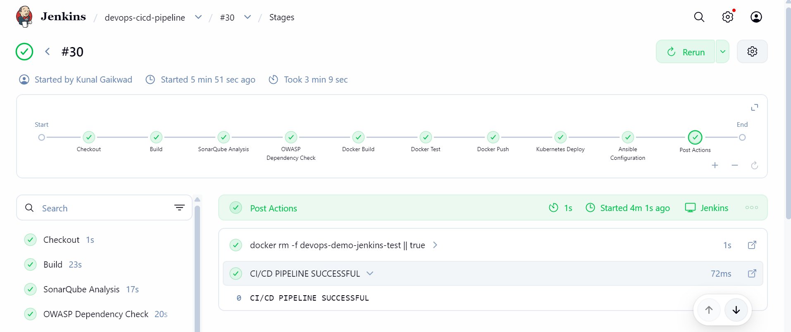
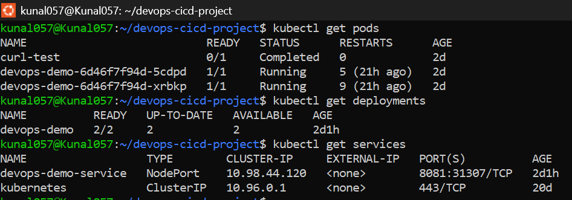
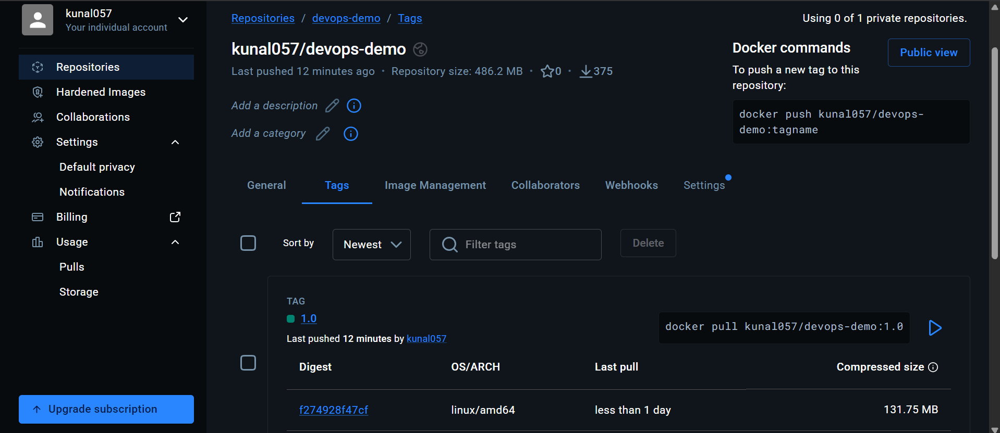
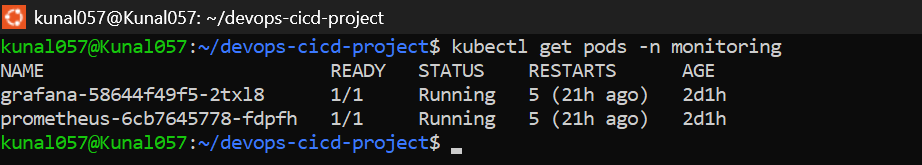
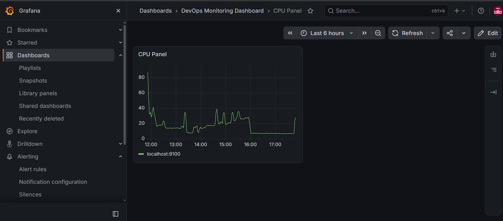
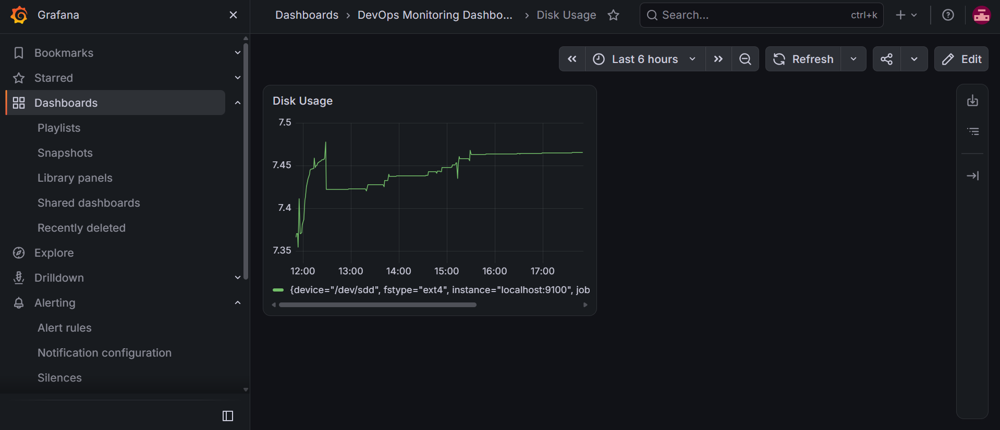
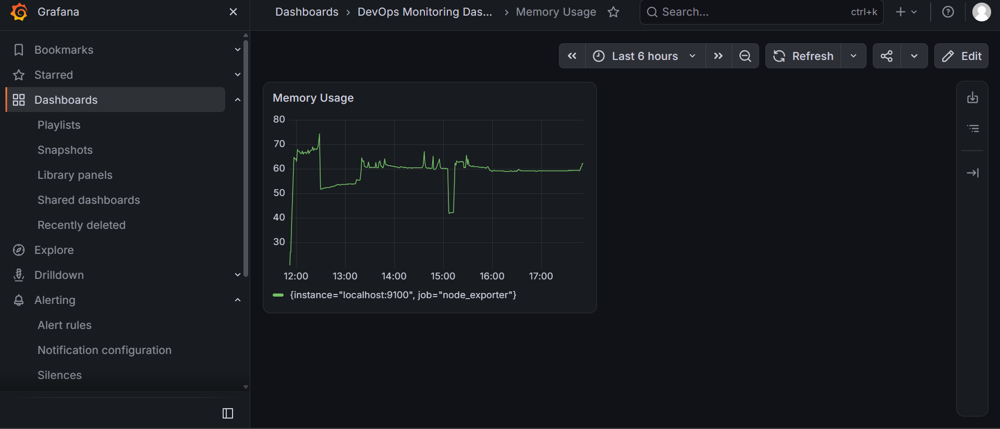
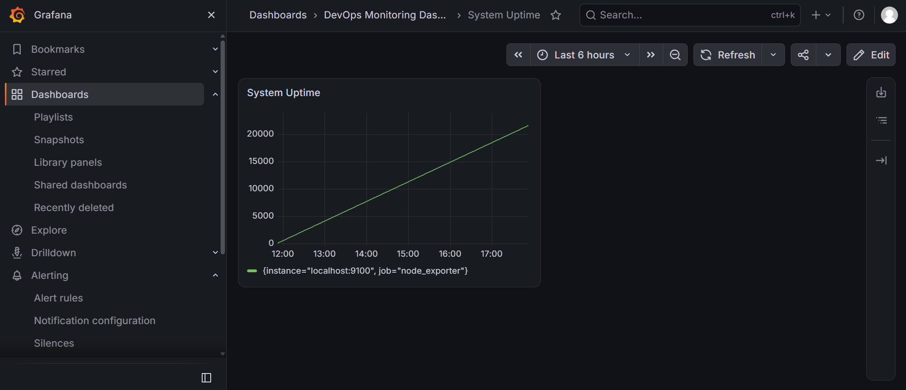

# End-to-End DevOps CI/CD Pipeline

## 📌 Project Overview

This project demonstrates an end-to-end DevOps CI/CD pipeline for a Spring Boot application.

The pipeline automates application build, code quality analysis, security scanning, Docker image creation, Docker Hub publishing, Kubernetes deployment, and configuration management using Ansible.

## 🏗️ Architecture

GitHub ↓ Jenkins ↓ Maven Build & Test ↓ JaCoCo Code Coverage ↓ SonarQube Code Analysis ↓ OWASP Dependency Check ↓ Docker Build ↓ Docker Test ↓ Docker Hub ↓ Kubernetes / Minikube ↓ Prometheus ↓ Grafana

Ansible is used for configuration management and Nginx configuration.

## 🛠️ Technologies Used

| Technology | Purpose |
|---|---|
| Git & GitHub | Source Code Management |
| Jenkins | CI/CD Automation |
| Maven | Build & Dependency Management |
| Java 21 | Application Runtime |
| Spring Boot | Application Framework |
| JaCoCo | Code Coverage |
| SonarQube | Code Quality Analysis |
| OWASP Dependency-Check | Dependency Security Scanning |
| Docker | Containerization |
| Docker Hub | Container Image Registry |
| Kubernetes | Container Orchestration |
| Minikube | Local Kubernetes Cluster |
| Prometheus | Metrics Monitoring |
| Grafana | Monitoring Dashboard |
| Ansible | Configuration Management |
| Linux / Ubuntu | Development Environment |

## 🔄 CI/CD Pipeline Stages

### 1. Checkout

Jenkins checks out the latest source code from the GitHub repository.

### 2. Build

Maven builds the Spring Boot application and executes the test cases.

### 3. SonarQube Analysis

SonarQube analyzes the source code for code quality issues and imports JaCoCo coverage results.

### 4. OWASP Dependency Check

OWASP Dependency-Check scans project dependencies for known security vulnerabilities.

### 5. Docker Build

The Spring Boot application is packaged into a Docker image.

### 6. Docker Test

The Docker container is started and the application health endpoint is tested.

### 7. Docker Push

The validated Docker image is pushed to Docker Hub.

Docker image:

`kunal057/devops-demo:1.0`

### 8. Kubernetes Deployment

The application is deployed to a local Minikube Kubernetes cluster.

The deployment uses two application replicas for availability.

### 9. Ansible Configuration

Ansible automates server configuration by installing and configuring Nginx and creating the application configuration.

## ☸️ Kubernetes Components

The application uses:

- Deployment
- Service
- Two application replicas
- Readiness probe
- Liveness probe
- Resource requests and limits
- NodePort service

Application service:

`devops-demo-service`

Application port:

`8081`

## 📊 Monitoring

Prometheus collects application metrics from:

`/actuator/prometheus`

The Prometheus target for the application is configured using the Kubernetes service DNS.

Grafana is connected to Prometheus for visualization and monitoring.

Monitoring includes:

- CPU Usage
- Memory Usage
- Disk Usage
- System Uptime
- Application availability

## 📸 Project Evidence

### Jenkins CI/CD Pipeline



### Kubernetes Deployment



### Docker Hub Image



### Prometheus Monitoring




### Grafana Dashboard 1



### Grafana Dashboard 2



### Grafana Dashboard 3



### Grafana Dashboard 4



## 🔐 Security & Quality

The pipeline includes:

- SonarQube static code analysis
- JaCoCo code coverage
- OWASP Dependency-Check
- Docker image validation
- Kubernetes health probes

## ⚙️ Project Structure

```text
devops-cicd-project/
├── app/
│   ├── pom.xml
│   ├── Dockerfile
│   └── src/
├── k8s/
│   ├── deployment.yaml
│   ├── service.yaml
│   ├── prometheus.yaml
│   └── prometheus-deployment.yaml
├── monitoring/
├── ansible/
│   ├── inventory
│   └── playbook.yml
├── screenshots/
│   ├── 01-jenkins-pipeline-success.png
│   ├── 02-kubernetes-deployment.png
│   ├── 03-dockerhub-image.png
│   ├── 04-prometheus monitoring.png
│   ├── 04-prometheus-monitoring.png
│   ├── 05-1grafana-dashboard.png
│   ├── 05-2grafana-dashboard.png
│   ├── 05-3grafana-dashboard.png
│   └── 05-4grafana-dashboard.png
├── Jenkinsfile
├── .gitignore
└── README.md
